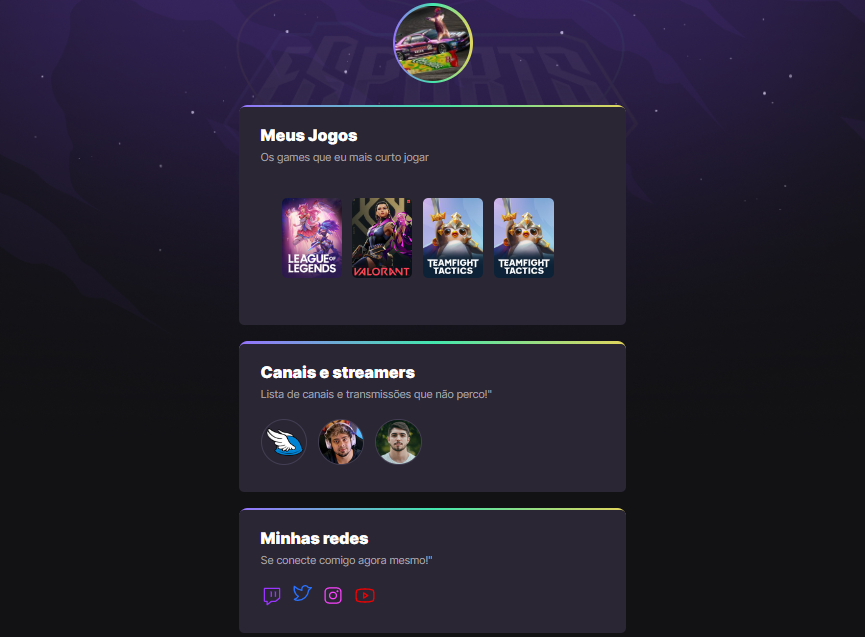

# NLW eSports 

> Trilha Explorer

Projeto construído no evento Next Level Week da Rocketseat

[Clique aqui para acessar](https://UmbreonX2.github.io/NLW)

## Tecnologias

- HTML
- CSS
- Git e GitHub

## Texto de redes sociais

Tema: redes sociais
As mídias sociais são tecnologias interativas que facilitam a criação e o compartilhamento de informações, ideias, interesses e outras formas de expressão por meio de comunidades e redes virtuais. Embora os desafios para a definição de mídia social surjam devido à variedade de serviços de mídia social autônomos e integrados atualmente disponíveis, existem alguns recursos comuns:

As mídias sociais são aplicativos interativos baseados na Internet da Web 2.0.

O conteúdo gerado pelo usuário – como postagens de texto ou comentários, fotos ou vídeos digitais e dados gerados por meio de todas as interações online – é a força vital das mídias sociais.

Os usuários criam perfis específicos de serviço para o site ou aplicativo que são projetados e mantidos pela organização de mídia social.

A mídia social ajuda o desenvolvimento de redes sociais online conectando o perfil de um usuário com o de outros indivíduos ou grupos. O termo social em relação à mídia sugere que as plataformas são centradas no usuário e permitem atividades comunitárias. Como tal, a mídia social pode ser vista como facilitadora online ou potencializadora de redes humanas – teias de indivíduos que melhoram a conectividade social. (por exemplo, smartphones e tablets). À medida que os usuários se envolvem com esses serviços eletrônicos, eles criam plataformas altamente interativas nas quais indivíduos, comunidades e organizações podem compartilhar, co-criar, discutir, participar e modificar conteúdo gerado pelo usuário ou auto-curado postado online. Além disso, as mídias sociais são usadas para documentar memórias, aprender e explorar coisas, fazer propaganda de si mesmo e formar amizades junto com o crescimento de ideias a partir da criação de blogs, podcasts, vídeos e sites de jogos. Essa relação em mudança entre humanos e tecnologia é o foco do campo emergente de autoestudos tecnológicos. Alguns dos sites de mídia social mais populares, com mais de 100 milhões de usuários registrados, incluem o Facebook (e seu associado Facebook Messenger), TikTok, WeChat, Instagram, QZone, Weibo, Twitter, Tumblr, Baidu Tieba e LinkedIn. Dependendo da interpretação, outras plataformas populares que às vezes são chamadas de serviços de mídia social incluem YouTube, QQ, Quora, Telegram, WhatsApp, Signal, LINE, Snapchat, Pinterest, Viber, Reddit, Discord, VK, Microsoft Teams e muito mais. Wikis são exemplos de criação de conteúdo colaborativo.

Os meios de comunicação social diferem da mídia tradicional (por exemplo, revistas impressas e jornais, TV e rádio) de várias maneiras, incluindo qualidade, alcance, frequência, usabilidade, relevância e permanência. Além disso, os meios de comunicação social operam em um sistema de transmissão dialógico, ou seja, muitas fontes para muitos receptores, enquanto os meios de comunicação tradicionais operam sob um modelo de transmissão monológico (ou seja, uma fonte para muitos receptores). Por exemplo, um jornal é entregue a muitos assinantes e uma estação de rádio transmite os mesmos programas para uma cidade inteira. Desde a dramática expansão da Internet, a mídia digital ou a retórica digital podem ser usadas para representar ou identificar uma cultura. Estudar como a retórica que existe no ambiente digital se tornou um novo processo crucial para muitos estudiosos.

Os observadores notaram uma ampla gama de impactos positivos e negativos quando se trata do uso das mídias sociais. A mídia social pode ajudar a melhorar o senso de conexão de um indivíduo com comunidades reais ou online e pode ser uma ferramenta eficaz de comunicação (ou marketing) para corporações, empreendedores, organizações sem fins lucrativos, grupos de defesa, partidos políticos e governos. Observadores também viram que tem havido um aumento de movimentos sociais usando as mídias sociais como uma ferramenta de comunicação e organização em tempos de agitação política.

História das redes sociais
Computação inicial
O sistema PLATO foi lançado em 1960, após ser desenvolvido na Universidade de Illinois e posteriormente comercializado pela Control Data Corporation. Ofereceu formas iniciais de recursos de mídia social com inovações da era de 1973, como o Notes, o aplicativo de fórum de mensagens da PLATO; TERM-talk, seu recurso de mensagens instantâneas; Talkomatic, talvez a primeira sala de bate-papo online; News Report, um jornal online de crowdsourcing, e blog e listas de acesso, permitindo que o proprietário de um arquivo de nota ou outro aplicativo limite o acesso a um determinado conjunto de usuários, por exemplo, apenas amigos, colegas de classe ou colegas de trabalho.

A ARPANET, que entrou online pela primeira vez em 1967, no final da década de 1970 desenvolveu um rico intercâmbio cultural de ideias e comunicação não-governamentais/comerciais, como evidenciado pela etiqueta de rede (ou 'netiqueta') descrita em um manual de 1982 sobre computação no MIT's Laboratório de Inteligência Artificial. A ARPANET evoluiu para a Internet após a publicação da primeira especificação do Transmission Control Protocol (TCP), RFC 675 (Specification of Internet Transmission Control Program), escrita por Vint Cerf, Yogen Dalal e Carl Sunshine em

